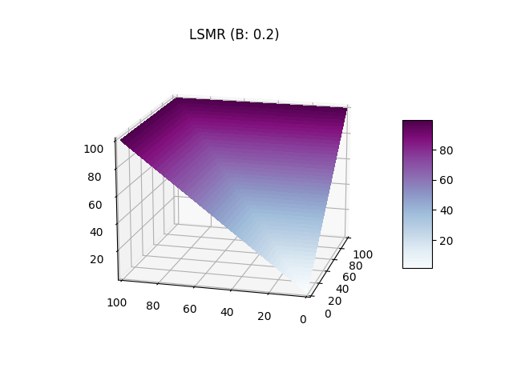
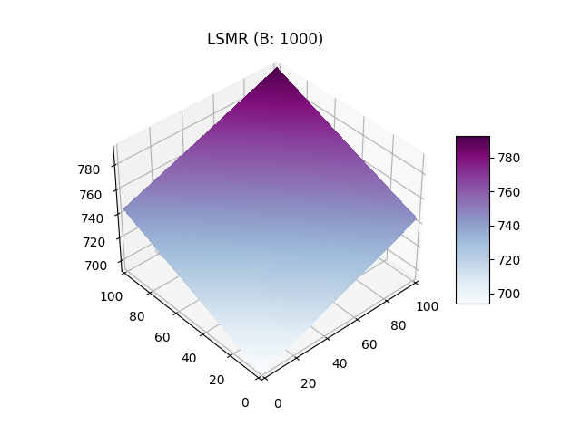

# Mesure du Risque

Le but des animateurs automatisés est de déterminer un prix juste en utilisant les informations des
agents sur le marché, lui meme étant non-informé.

## Règle de score de marché

Tout d'abord nous définissons une règle de score. Considérons deux variables aléatoires \\(Y: \Omega
\mapsto X\\) et \\(G: \Omega \mapsto Z\\), ou respectivement \\(Y\\) et \\(G\\) sont les
probabilités visées par l'estimation et les probabilité générés par l'estimation. Une fonction de
score est définit par \\(S: Y \times G \mapsto \mathbb{R}\\). Autrement dit il s'agit d'une fonction
mathématique associant à un ensemble de probabilités estimés un nombre que l'on peut interpreter
comme la "justesse" de l'approximation. On considère que le point qui minimise la fonction de score
est celui ou les probabilités se rapproche le de l'évènement réel.

Avec une règle de score, les agent rapportent leurs probabilités pour chaque évènement et recoivent
un paiement selon chaque réalisation. Une règle de score de marché est une règle de score ou tout le
monde peut changer ses choix à chaque instant et recevoir un paiement dependant de son estimation
finale. Le cout induit par la règle de score de marché est celui de la dernière estimation
rapportée, comparée à la première. Dans [Hanson (2002)](https://mason.gmu.edu/~rhanson/mktscore.pdf)
l'auteur montre que toute fonction de score rapportant des probabilités honnètes peut être utilisé
comme règle de score de marché.

## Animateurs de marché à fonction de score

Nous décrivons désormais le déroulement des échanges avec un animateur de marché automatique à
fonction de score. Ce dernier commence avec un état initiale (généralement \\(\vec{0}\\)). Les
agents interagissent avec l'animateur en modifiant son état interne de \\(x\\) à \\(x'\\) pour un
prix de \\(C(x') - C(x)\\). Par exemple pour des évènement indépendants et complémentaires
\\(\omega_1\\) et \\(\omega_2\\) et un état initial de \\(\\{0, 0\\}\\) si un agent souhaite acheter
deux titres associés à \\(\omega_2\\) il devra d'affranchir de \\(C(\\{0, 0 + 2\\}) - C(\\{0,
0\\})\\). Ainsi on peut qualifier le prix d'un actif comme le gradient de la fonction de score par
rapport à cet actif.

## Propriétés désirables des fonctions de score de marché

Il existe un ensemble de propriété désirables pour ces règle de score, en effet on aimerait limiter
la perte d'un animateur de marché et proposer des prix cohérents. On liste cinqs propriétés
désirables:

#### 1. Monotonie

\\[\forall x,y \space s.t. \space x_i \le y_i, \space C(x) \le C(y)\\]

Interprétation: le prix marginal d'un ordre ne décroit jamais, empechant d'acheter des combinaisons
à prix 0 en faisant des gains.

#### 2. Convexité

\\[\forall x,y \space and \space \lambda \in [0, 1] \\] \\[C(\lambda x + (1-\lambda) y) \le \lambda
C(x) + (1 - \lambda) C(y) \\]

Interprétation: une annonce diversifié donne un score plus faible que deux annonces séparés. Ainsi
cela incite à la diversification des portfeuilles.

#### 3. Perte borné

\\[\sup_x[\max_i(x_i) - C(x)] \lt \infty \\]

Interprétation: permet d'assurer une perte borné peu importe les actions des agents et les états
réalisés.

#### 4. Invariance à la translation

\\[\forall \vec{x},\alpha \\] \\[C(x + \vec{1} \alpha) = C(x) + \alpha \\]

Interprétation: Si on pari \\(\alpha\\) unités sur tous les états on paie \\(\alpha\\) unités.

#### 5. Homogénéité positive

\\[\forall \vec{x},\gamma \gt 0\\] \\[C(x \gamma) = C(x) \gamma \\]

Interprétation: Si on double son pari on paie double.

## Impossibilité du résultat

D'après ces propriétés il est possible de prouver qu'il n'existe qu'une fonction qui les statisfait
toutes et il s'agit de la fonction de score max:

\\[ C(x) = \max_{x_i} x\\]

Cependant cette fonction implique qu'il est gratuit de déplacer l'animateur de marché d'un état
\\(\\{1, 0\\}\\) à l'état \\(\\{1, 1\\}\\). En pratique il s'agit d'une mauvaise mesure du risque et
ainsi il est impossible de satisfaire toutes ces propriétés.

Pour diminuer la restriction on enlève généralement soit l'homogénéité positive ou l'invariance à la
translation. La fonction présentée dans la partie suivante satisfait les 4 premières propritétés.

## Règle de score de marché logarithmique (Logarithmic Market Scoring Rule)

Définition:

\\[ C(x) = b\log{\sum_i{\exp(x_i/b)}} \\]

\\[ p_i(x) = {\exp(q_i/b) \over {\sum_k \exp(q_k/b)}} \\]

La règle de score logarithmique a été introduite par Hanson elle est lié à un paramètre \\(b\\) qui
influe sur la liquidité (illustration ci- dessous). Elle à l'avantage de garantire l'indépendance
des effets liés aux actions des individus. En effet, lorsqu'un individu fait un pari sur un
évènement A lié à un évènement B alors l'estimation de probabilité lié à l'autre évènement n'est pas
modifié. Cette fonction est particulièrement utile pour les marchés combinatoires.

Le paramètre \\(b\\) influe négativement sur le gradient, si on compare graphiquement un \\(b=0.2\\)
et \\(b=1000\\) on observe que sur le premier graphique le score le plus haut est atteint beaucoup
plus rapidement avec une "valée" des paris diversifiés ou le score monte plus lentement. Sur le
second graphique le plan est quasiment plat est les valeurs les plus hautes sont atteinte seulement
lors des plus grandes combinaisions autour (10, 10). Ainsi le paramètre \\(b\\) influe sur la
liquidité car un \\(b\\) faible permet d'inciter un report équitable des probabilités avec un score
plus elevé pour les ajouts unilatéraux réduisant ainsi le nombre potentiels de personnes sur le
marché.

 
