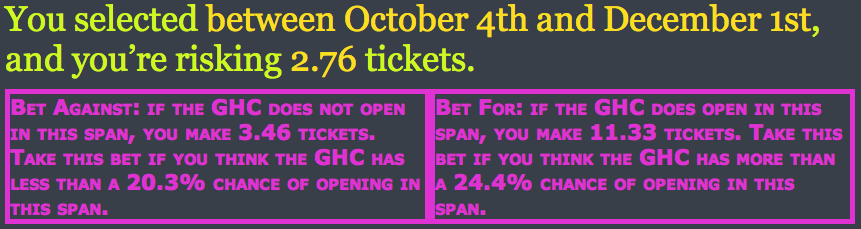
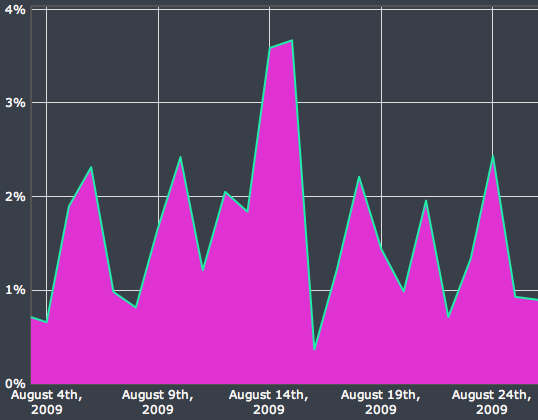
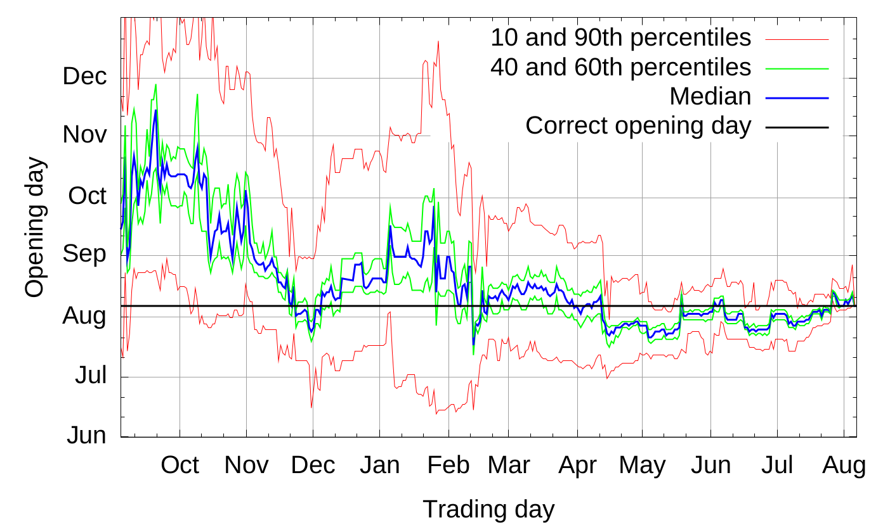
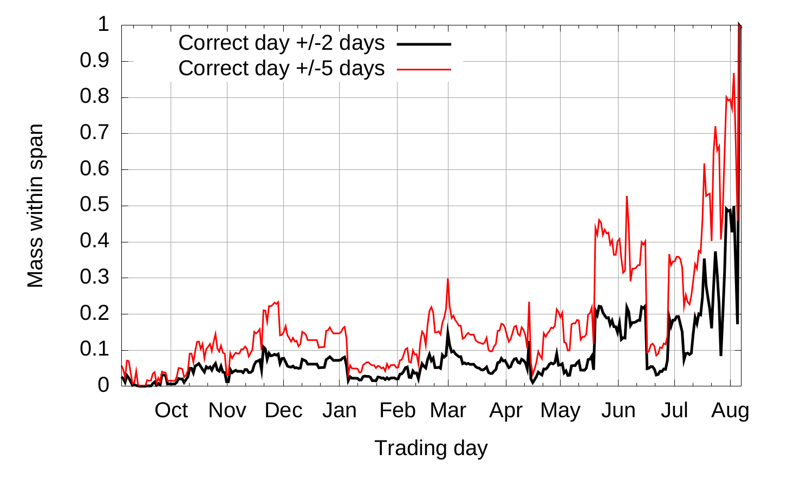

# Gates Hillman Prediction Market

L'expérience du Gates Hillman Prediction Market (GHPM) est un exemple de marché de l'information ou
les individus échangent sur les probabilités d'un évènement, en l'occurence l'ouverture du centre
Gates-Hillman à l'université Carnegie-Mellon. Menée par Abraham Othman et Tuomas Sandholm,
l'expérience aura duré un an avec 169 individus actifs pour 210 inscrits.

## Mise en place

Un problème lié à la mise en place de marchés de l'information est la définition exacte des
évènements de tel sorte que l'on sache si ils se sont réalisés. En effet par le mot ouverture on
pourrait penser à la fin des travaux comme à l'enménagement complet du personnel. La définition vers
laquelle s'est tendu l'experience est "lorsque 50% de l'espace occupable aura reçu son permis
d'exploitation" qui est un élément aisément vérifiable administrativement.

Afin qu'assez d'invidus participent au marché les organisateurs ont recolté un prix pour le tirage
au sort final pondéré par le nombre d'actifs de chaque participant. Deplus, les participants
recevaient 20 tickets gratuits lors de l'inscription et 2 tickets par semaine s'ils étaient actifs.

## Fonctionnement

Le GHPM utilisait une fonction de score de marché logarithmique avec un paramètre \\(b=32\\). Afin
de pouvoir parier sur une date, il a fallu trouver un manière en trois temps de faire l'échange. En
effet, en premier les paris étaient eux formulés sur un interval de temps plutot que sur des jours
uniques car les individus ont du mal à raisonner sur des probabibilités faibles (Ali, 1977). Dans
cette même requète les individus indiquaient un montant à parier. Ensuite, l'animateur de marché
proposait deux contrats "pour" et "contre" indiquant le montant gagné et la probabilité associée.
Enfin l'utilisateur choisissait un contrat et recevait le montant de ticket désignait si au cours de
la période l'évènement selectionné s'était réalisé.

^ Capture d'écran de l'interface.

Les montants gagné \\( \pi_j\\) pour une période \\([i, j]\\) étaient calculés selon les équations
qui satisfont l'invariance à la translation pour le pari \\(r\\):

- Les paris "pour": \\[ C(q_1, ..., q_i + \pi_j, ... + \pi_j, q_j + \pi_j, ...) = C(q) + r\\]
- Les paris "contre": \\[ C(q_1 + \pi_j, ... + \pi_j, q_i, ... , q_j, ...+ \pi_j) = C(q) + r\\]

La résolution des équations était faite en utilisant la
[méthode de newton](https://en.wikipedia.org/wiki/Newton%27s_method) et donc approximée.

## Résultats

Dans cette section nous présentons les problèmes revélés par l'experience et les stratégies qui s'en
sont suivis.

### Pics de prix

Un des problèmes principaux qui est apparu lors de l'experience du GHPM est l'apparition de pics de
prix, en effet on pouvait observer une grande difference de prix sur deux jours différents comme le
montre le graphique ci-dessous tiré du papier originel:

Ce problème trouve un fondement théorique, une règle de score ne produisant pas de pics doit
satisfaire la contrainte:

\\[ \lim_{p_i \to 0} {\delta q \over \delta q^2_i} p_i(q_i, q_{-i}) \le 0 \\]

Qui indique que le prix doit être concave par rapport aux quantités. Le papier présente une preuve
expliquant qu'une règle de score libre (opposé à une règle de score borné manuellement) ne peut pas
satisfaire cette contrainte. L'inconvénient des règle de score borné manuellement viendrait d'une
implémentation plus complexe informatiquement et donc moins efficace.

Lors de l'expérience cet effet à eu un impact sur la stratégie des agents. Les chercheurs ont mené
des interviews avec certains utilisateur, lors d'une de ces interviews une personne admet avoir
suivis ces pics afin de parier contre car selon lui ils venait d'une mauvaise estimation de la part
des autres agents qui avait parié sur des périodes très courtes, de cette manière une fois les
périodes surestimés passés il gagnait ses paris.

### Insensibilité à la liquidité

En utilisant la fontion LMSR, l'animateur de marché satisfait l'invariance à la translation et ainsi
produit les mêmes variation de prix peut importe la quantité d'actifs présents sur le marché, ce qui
est contre-intuitif lorsque l'on pense aux marchés en pratique. Cette proprieté permet d'eviter les
opportunités d'arbitrage mais accentue les effets marginaux sur des marchés "profonds", avec un
grand nombre d'actifs disponibles.

Cet effet à eu un impact négatif sur l'experience, notamment sur la fin, car les agents avait peur
de faire des mouvements plus gros qui auraient pu faire basculer la valeur de leur portefeuille.
D'après une interview, vers la fin de l'expérience une des personnes les mieux placés a essayé de
limiter ses placement afin de justement eviter de former des pics liés à cet insensibilité à la
liquidité.

Une solution à ce problème est exploré dans le papier _A Practical Liquidity-Sensitive Automated
Market Maker_ par A. Othman et D. Pennock.

## Estimation

Les estimations du GHPM sont présentés par ce graphique tiré du papier.

Une observe une convergence des estimations plus la veritable date approchait, la convergence touche
tous les pourcentiles. A partir de Février, lors d'une seconde annonce officielle la période
d'ouverture était plus ou moins connu et on observe que des petites variations à partir de ce moment
la alors que les annonces suivantes en Juillet on amélioré la prédiction jusqu'à la date d'ouverture
alors que la tendance prévoyait une période un peu plus longue.

Le graphique suivant présente la masse de personnes ayant eu un iterval correct en fonction des mois
où le marché était ouvert.

